# 酷达物联 (app-frame)

面向智能家居/IoT 场景的 **Android 业务 Demo**，展示账号、设备、场景、消息与设置等完整主路径。  
本仓库已从 2017 Java MVP 重构为 **Kotlin + MVVM + Material 3** 现代化架构，默认可在无后端环境下用 DemoMode 跑通。

## 功能

- 登录 / 注册 / 找回密码
- 微信第三方登录入口（仅 `SendAuth`，**不下发 AppSecret**）
- 设备列表、添加设备、**CameraX + ML Kit 扫码添加**、智能场景
- 消息中心
- 个人资料、换绑手机、反馈、关于、产品说明、公众号页
- 设置：Demo 模式开关、通知、检查更新、清缓存、退出登录

## 架构

```
app/      UI + Navigation（单 Activity）
domain/   领域模型
data/     ApiService / Repository / DataStore / DemoDataSource
core/     AppResult、工具
```

- UI: AndroidX · Material 3 · ViewBinding · Navigation · BottomNavigation
- 异步: Coroutines + Flow
- DI: Hilt
- 网络: Retrofit 2 + OkHttp 4（保持旧契约：`content` JSON + `custom_token`）

## DemoMode

Debug 默认开启 DemoMode（`local.properties` 中 `DEMO_MODE=true`，设置页可切换）。

- **开**：本地假数据，无需 `sit.wecarelove.com`
- **关**：走真实 `ApiService`，请求形态与旧版 HttpApi 对齐；设备/场景列表支持多种 `data` 形态解析（`devices` / `device_list` / `list` 数组等）

## 微信登录说明

客户端只发起 `SendAuth` 并拿到 `code`（`WX_APP_ID` 配在 `local.properties`）。  
**AppSecret 不得进 APK**；应用服务端用 `code` 换 `access_token` / `openid` 后，再调后端 `user/thridlogin`。DemoMode 下用本地桩会话模拟该流程。

## 构建

要求：

- JDK 17
- Android Studio Ladybug+ / AGP 8.7
- Android SDK 35

```bash
# Windows
copy local.properties.example local.properties
# 编辑 sdk.dir=...

gradlew.bat assembleDebug
```

```bash
# macOS / Linux
cp local.properties.example local.properties
# 编辑 sdk.dir=...

./gradlew assembleDebug
```

可选签名与微信 AppId 见 `local.properties.example`。

## 截图

### 2.0 Material 3

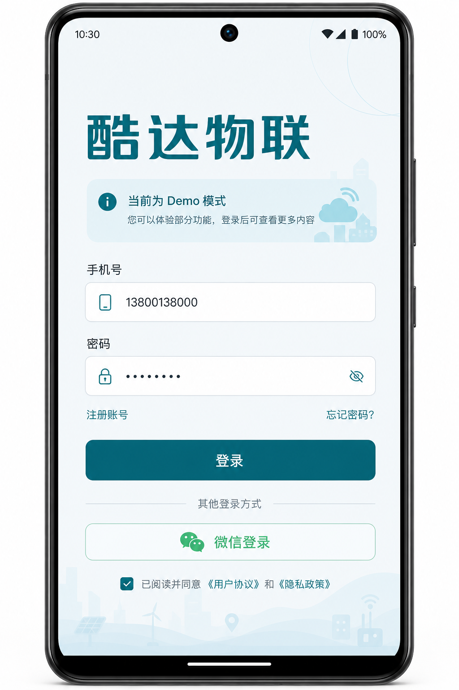      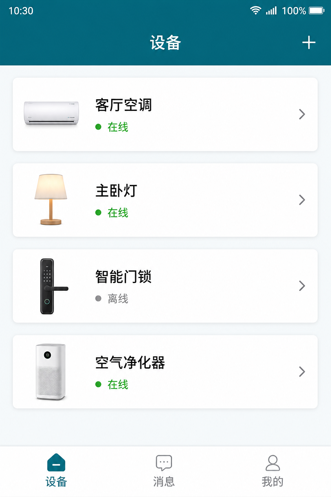

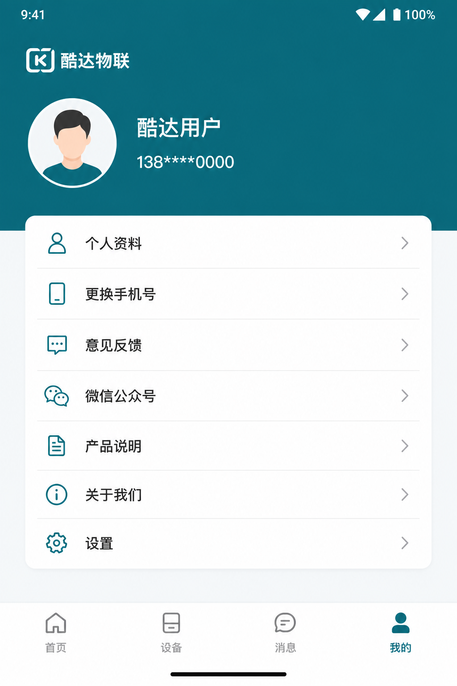      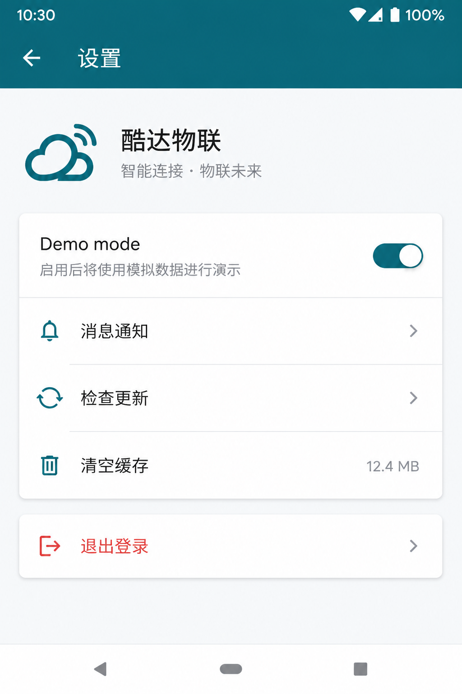

### 历史界面（归档）

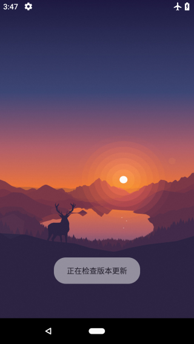      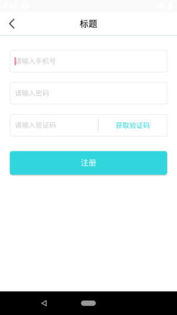

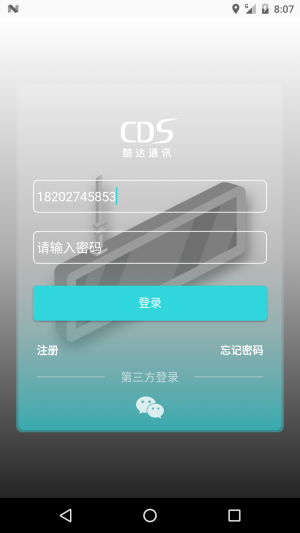      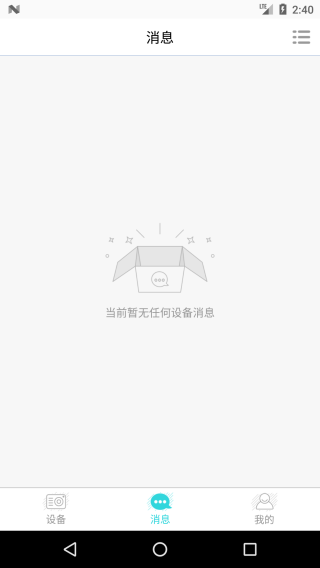

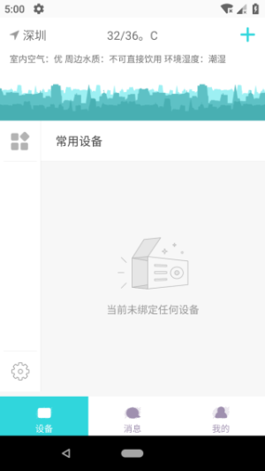      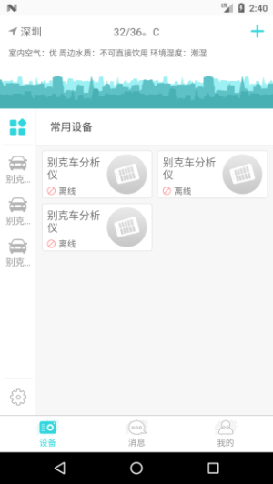

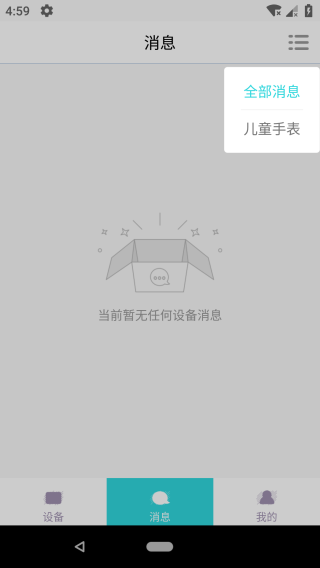 	 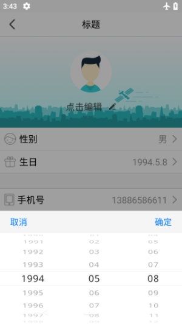

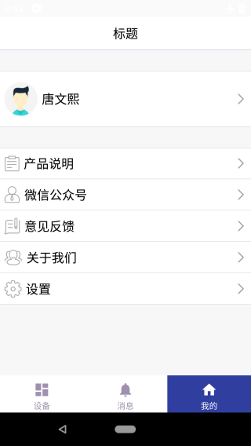      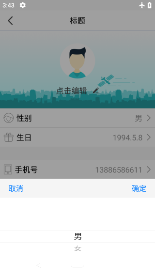

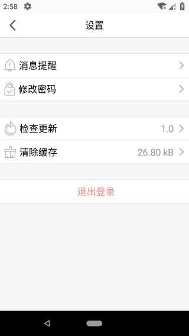		 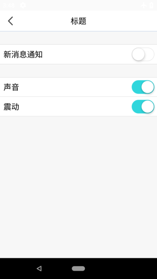

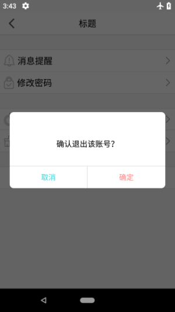		 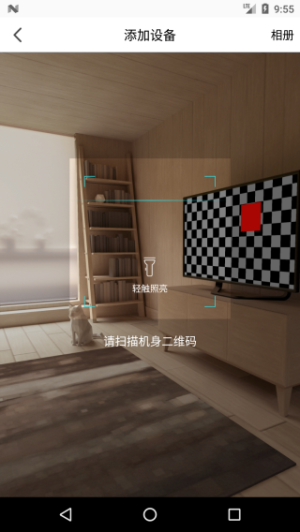

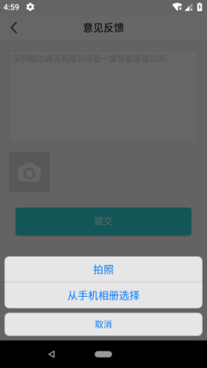

## License

Apache License 2.0 — 见 [LICENSE](LICENSE)
