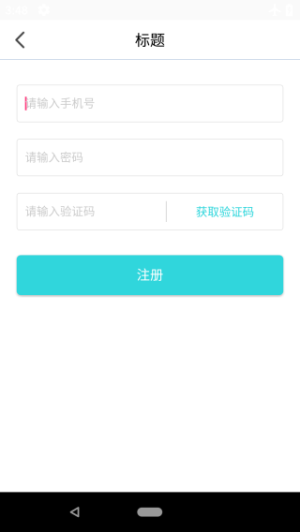
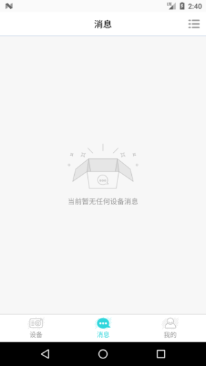
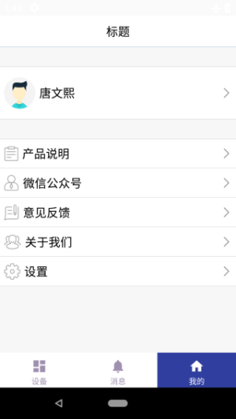

# app-frame
一个App框架。

## Fuction

- 权限检查功能
- Retrofit + Rxjava  + Mvp 实践
- 支持 Https
- 微信第三方登录
- 使用 RadioGroup + viewPager 底部导航栏
- 自定义对话框
- 清空缓存功能
- 时间选择控件
- 仿qq自定义弹出框
- 拍照、相册功能
- 二维码扫描功能
- 使用模板、单例模式
- 文件日志系统
- 各种工具类

## Review

      		

      

      

 	 

      

		 

		 

### Contact Me

- Github: github.com/cheng2016
- Email: mitnick.cheng@outlook.com
- QQ: 1102743539

# License

    Copyright 2016 cheng2016,Inc.
    
    Licensed under the Apache License, Version 2.0 (the "License");
    you may not use this file except in compliance with the License.
    You may obtain a copy of the License at
    
        http://www.apache.org/licenses/LICENSE-2.0
    
    Unless required by applicable law or agreed to in writing, software
    distributed under the License is distributed on an "AS IS" BASIS,
    WITHOUT WARRANTIES OR CONDITIONS OF ANY KIND, either express or implied.
    See the License for the specific language governing permissions and
    limitations under the License.

